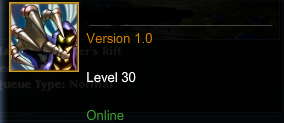
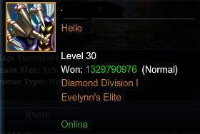

#Status
Creating a status:
```python
import zxlolbot

bot = zxlolbot.zxLoLBoT("username", "password")
bot.connect()
bot.set_status(level=30, status_msg="Version 1.0")
```



List of available parameters:

* profile_icon - This doesn't actually change your icon but it should. I need to check into it
* level - Self explanatory. Can be any number, even negative ones.
* status_msg - Text under the username in the friendlist
* wins - Self explanatory. Can be any number, not negative ones. Maximum 1329790976
* leaves - Self explanatory. Can be any number, not negative ones.
* queue_type - Highest queue type to display stats from. Not required to spoof a rating.
* ranked_league_name - Name of your ranked league. Must be a valid one or it will start with ** and spaces won't work.
* ranked_league_division - Can be either I, II, III, IV, V
* ranked_league_tier - Can be either: UNRANKED, BRONZE, SILVER, GOLD, PLATINUM, DIAMOND, CHALLENGER
* ranked_rating - Rating to be shown in game lobby. Obsolete at the moment.
* ranked_losses - Amount of ranked losses. Obsolete at the moment.
* ranked_wins - Amount of ranked wins. Obsolete at the moment.
* skinname - Name of the champion you are playing if gameStatus is inGame
* game_status - Can be either: inGame, outOfgame

set_status remembers your previous status settings. You don't have to include all previous one you've made to newer one if for example you just wanna change statusMsg.

You can spoof most of the data above, Example:

